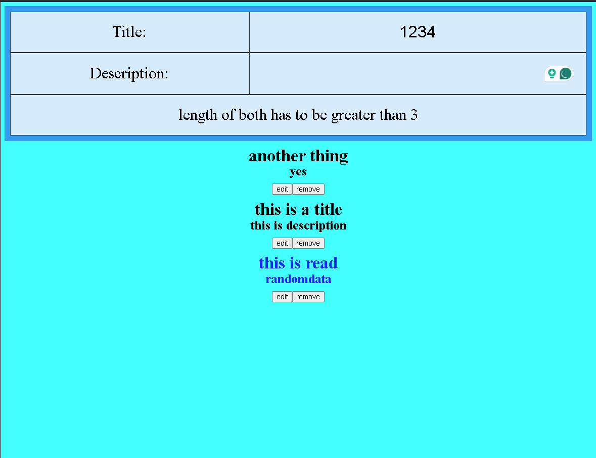

# Blog Application

This application is a simple and intuitive blog application that allows users to create, update, and manage blog posts. The application is built with React and Vite.

## Application Preview


## Features

- **Add a Blog Post**: Users can add a new blog post. Each blog post requires a title and a description.
- **View Blog Posts**: Blog posts are displayed in descending order, with the newest posts appearing first.
- **Read and Sort Blog Posts**: When a blog post is clicked and read, it moves to the bottom of the list.
- **Update a Blog Post**: Users can update the title and description of their blog posts.
- **Remove a Blog Post**: Users can remove a blog post when it's no longer needed.
- **Blog Post Length**: Each blog post must be at least 3 characters long.

## Installation

To set up this project on your local machine, follow these steps:

1. Clone the repository:
    ```bash
    git clone https://github.com/Tariq-Sekhri/blog-app
    ```

2. Navigate into the project directory:
    ```bash
    cd blog-app
    ```

3. Install the dependencies:
    ```bash
    npm install
    ```

4. Start the development server:
    ```bash
    npm run dev
    ```

Now, you can open your browser and visit `http://localhost:5173` to view the app.

## Technologies Used

- React
- Vite
- ESLint

## Contributing

Contributions are welcome! Please feel free to submit a Pull Request.
